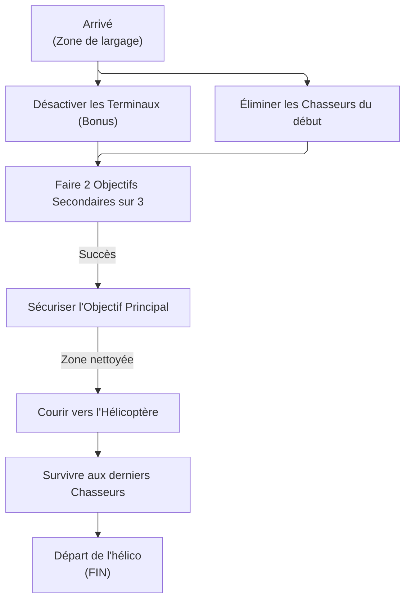

# RAPPORT D'OPÉRATION : COMPTE À REBOURS (Centrale Pentco)

À l'attention de tous les agents de la Division. Voici votre briefing avant le déploiement.

## 1. SITREP (Point de Situation)

**Cible :** Centrale électrique de Pentco.
**La Menace :** Une faction ennemie (Hyènes, True Sons, Nettoyeurs, Black Tusk) a pris le contrôle du site. Pire encore, des "Chasseurs" d'élite (Hunters) supervisent l'opération.
**Votre Mission :** Sécuriser la centrale, éliminer les Chasseurs, récuperer votre butin (butin ciblé) et vous enfuir avant que le site ne soit totalement verrouillé.
**Effectif :** 8 Agents _(2 équipes de 4)_.

## 2. Le Plan d'Action (Comment ça marche)

Cette mission est une véritable course contre la montre. L'action est intense et vous n'avez pas le temps de vous reposer.

- **Le Compte à Rebours :** Vous avez exactement 15 minutes pour réaliser les objectifs puis 4 minutes pour vous extraire. Pas une de plus.
- **Le Butin _("Loot")_ :** Avant de lancer la mission, vous pouvez choisir sur votre carte quel type d'équipement vous voulez trouver en priorité (fusils d'assaut, sacs à dos, etc.). Les ennemis auront plus de chances de laisser tomber ce type d'équipement.

### Étapes de la mission :

1. **Atterrissage :** À peine posés, vous tomberez nez à nez avec les premiers Chasseurs. Éliminez-les en équipe, il y en a entre 1 et 4 en fonction de la difficulté. Dans le même temps vous devrez désactiver les contres-mesures.
2. **Objectifs de zone :** La centrale abrite 3 missions secondaires (ex: protéger un VIP, détruire des serveurs...). Vous devez en réussir au moins 2 pour débloquer la suite, chaque zone possède un coffre noir à ouvrir (Loot secondaire cf : map).
3. **L'Objectif Principal :** Une fois les zones sécurisées, un objectif principal sera disponible. Une fois fait un coffre orange sera débloqué (Loot principal cf : map)
4. **L'Extraction :** Le temps presse ! Foncez vers l'hélicoptère, survivez à l'assaut final (avec de nouveaux Chasseurs) et grimpez à bord de l'hélico avec votre butin.
_note : le but de ce mode de jeu est la collecte de butin, utilisez tout le temps à votre disposition durant la phase d'extraction pour amasser le plus de butin possible._

## 3. Le Piratage Ennemi : Les "Contre-mesures"

L'ennemi a piraté le système de la centrale pour "tricher" et avoir l'avantage sur vous. 
Dès votre arrivée, vous verrez 3 icônes rouges sur votre écran : ce sont des terminaux informatiques.

### Comment réagir ?

Ces contre-mesures enemies vous affecte de différentes façons, vous devez les désactiver pour retrouver votre force de frappe.

**Liste des contre-mesures :**

| icon                                                          | Contre mesure active                        | Description                                                                                                                               | icon                                                        | Contre mesure désactivé                                      | description                                                                                           |
|---------------------------------------------------------------|---------------------------------------------|-------------------------------------------------------------------------------------------------------------------------------------------|-------------------------------------------------------------|--------------------------------------------------------------|-------------------------------------------------------------------------------------------------------|
|                           | Les ennemis lâchent une IEM à leur mort     | Lorsqu'ils meurent, les ennemis déploient une IEM (désactivation) qui peut affecter les agents et leurs compétences dans un rayon de 15 m |                         | Réduction du temps de recharge de compétence par élimination | Les agents réduisent de 25% le temps de recharge de la compétence s'ils tuent un ennemi dans les 15 m |
|  | Résistance ennemie aux altérations d'état   | Les ennemis gagnent 100% de résistance aux altérations d'état                                                                             |  | Effets d'état augmentés                                      | Les agents gagnent +25% de durée d'effets d'état                                                      |
|                           | Résistance aux altérations d'état réduite   | La résistance aux altérations d'état des agents est réduite de -25%                                                                       |                         | Résistance ennemie aux altérations d'état réduite            | La résistance aux altérations d'état des agents est réduite de -25%                                   |
|                           | Résistance ennemie aux explosions           | Les ennemis gagnent +100% de résistance aux explosions                                                                                    |                         | Dégâts des explosions augmentés                              | Les agents gagnent +25% de dégâts d'explosions                                                        |
|                           | Résistance ennemie aux headshots            | La résistance des ennemis aux headshots est augmentée de 25%                                                                              |                         | Dégâts de headshot des agents augmentés                      | Les agents gagnent +25% de dégâts de headshot                                                         |
|                           | Résistance critique ennemie                 | Les ennemis réduisent les probabilités critiques reçues de 25%                                                                            |                         | Probabilité critique augmentée                               | Les agents gagnent +25% de probabilités critiques                                                     |
|                           | Résistance ennemie à courte portée          | Les agents infligent 75% de dégâts aux ennemis situés à moins de 15 m                                                                     |                         | Dégâts à courte portée augmentés                             | Les agents infligents +25% de dégâts d'arme aux ennemis situés à moins de 15 m                        |
|                           | Résistance ennemie à longue portée          | Les agents infligent 75% de dégâts aux ennemis situés à plus de 35 m                                                                      |                         | Dégâts à longue portée augmentés                             | Les agents infligents +25% de dégâts d'arme aux ennemis situés à plus de 35 m                         |
|                           | Résistance ennemie aux dégâts de compétence | Les ennemis gagnent +50% de résistance aux dégâts de compétence                                                                           |                         | Résistance ennemie aux dégâts de compétence réduite          | La résistance des ennemis aux dégâts de compétence est réduite de +25%                                |
|                           | Dégâts de compétence des agents réduits     | Les dégats de compétence des agents sur les ennemis sont réduits de 50%                                                                   |                         | Dégâts de compétence des agents augmentés                    | Les agents gagnet +25% de dégâts de compétence                                                        |
|                           | Recharge de compétence augmentée            | La recharge des compétences des agents est doublée                                                                                        |                         | Recharge de compétence diminuée                              | La recharge des compétences des agents diminue de 25%                                                 |
|                           | Réparation d'armure ennemie                 | Les ennemis reçoivent +25% des réparations d'armures réçues                                                                               |                         | Réparation d'armure                                          | Les agents gagnent +25% pour les réparations d'armure reçues                                          |
|                           | Vitesse de rechargement réduite             | La vitesse de rechargement totale des armes des agents est abaissée à 75%                                                                 |                         | Vitesse de rechargement accrue                               | Les agents gagnent +25% de vitesse de rechargement d'armes                                            |

Il est extrêmement recommandé de désactiver les terminaux afin de continuer la mission dans des conditions optimales.

## 4. Les objectifs de la mission

Vous trouverez ci-joint une carte tactique des emplacements de coffres accessibles durant vos objectifs.

## 5. Extraction

La centrale a été sécurisé, vous devez maintenant vous extraire. Cependant, des chasseurs accompagné de Black-Tusks se sont re-introduit dans la zone pour vous empêcher d'en sortir vivant.
Leur élimination sera nécessaire pour vous extraire en un seul morceau !

Une fois votre mission terminée, vous gagnerez un certain nombre de Crédits de countdown.
Ces crédits vous permettront d'acheter divers items au poste de countdown à la maison blanche.
Ce poste de countdown peux vendre des items normalement réserver à la Darkzone.

### FIN DE TRANSMISSION