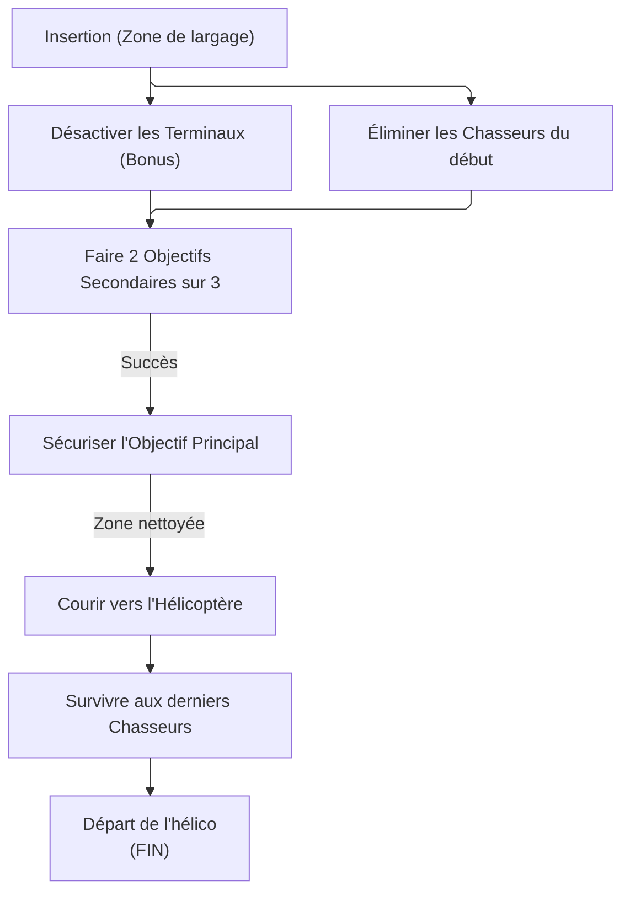

# RAPPORT D'OPÉRATION : COMPTE À REBOURS (Centrale Pentco)

À l'attention de tous les agents de la Division. Voici votre briefing avant le déploiement.

## 1. SITREP (Point de Situation)

**Cible :** Centrale électrique de Pentco.
**La Menace :** Une faction ennemie (Hyènes, True Sons, Nettoyeurs) a pris le contrôle du site. Pire encore, des "Chasseurs" d'élite (Hunters) supervisent l'opération.
**Votre Mission :** Sécuriser la centrale, récupérer le matériel de valeur _(loot en butain ciblé)_, et vous enfuir avant que le site ne soit totalement verrouillé.
**Effectif :** 8 Agents _(2 équipes de 4)_.

## 2. Le Plan d'Action (Comment ça marche)

Cette mission est une véritable course contre la montre. L'action est intense et vous n'avez pas le temps de vous reposer.

- **Le Compte à Rebours :** Vous avez exactement 15 minutes. Pas une de plus.
- **Le Butin _("Loot")_ :** Avant de lancer la mission, vous pouvez choisir sur votre carte quel type d'équipement vous voulez trouver en priorité (fusils d'assaut, sacs à dos, etc.). Les ennemis auront plus de chances de laisser tomber ce type d'équipement.

### Étapes de la mission :

1. **Atterrissage :** À peine posés, vous tomberez nez à nez avec les premiers Chasseurs. Éliminez-les en équipe.
2. **Objectifs de zone :** La centrale abrite 3 missions secondaires (ex: protéger un VIP, détruire des serveurs...). Vous devez en réussir au moins 2 pour débloquer la suite.
3. **L'Objectif Principal :** Une fois les zones sécurisées, un objectif principal sera disponible.
4. **L'Extraction :** Le temps presse ! Foncez vers l'hélicoptère, survivez à l'assaut final (avec de nouveaux Chasseurs) et grimpez à bord avec votre butin.
_note : le but de ce mode de jeu est la collecte de butin, utilisez tout le temps a votre disposition durant la phase d'extraction pour ammasser le plus de butin possible._

## 3. Le Piratage Ennemi : Les "Contre-mesures"

L'ennemi a piraté le système de la centrale pour "tricher" et avoir l'avantage sur vous. 
Dès votre arrivée, vous verrez 3 icônes rouges sur votre écran : ce sont des terminaux informatiques.

### Comment réagir ?

Ces contre-mesures enemies vous affecte de différentes façons, vous devez les désactiver pour retrouver votre force de frappe.

**Liste des contre-mesures :**

| icon                                                          | Contre mesure active      | Description                          | icon                                                        | Contre mesure désactivé          | description                              |
|---------------------------------------------------------------|---------------------------|--------------------------------------|-------------------------------------------------------------|----------------------------------|------------------------------------------|
|  | Hostil Hazard Resistance  | Enemies gain 100% Hazard Resistance  |  | Status Effect Incrased           | Agents gain +25% status effects duration |
|                           | nom contre-mesure 2       | effet contre-mesure 2 activé         |                         | effet contre-mesure 2 désactivé  |                                          |
|                           | nom contre-mesure 3       | effet contre-mesure 3 activé         |                         | effet contre-mesure 3 désactivé  |                                          |
|                           | nom contre-mesure 4       | effet contre-mesure 4 activé         |                         | effet contre-mesure 4 désactivé  |                                          |
|                           | nom contre-mesure 5       | effet contre-mesure 5 activé         |                         | effet contre-mesure 5 désactivé  |                                          |
|                           | nom contre-mesure 6       | effet contre-mesure 6 activé         |                         | effet contre-mesure 6 désactivé  |                                          |
|                           | nom contre-mesure 7       | effet contre-mesure 7 activé         |                         | effet contre-mesure 7 désactivé  |                                          |

Il est extrêmement recommandé de désactiver les terminaux affin de continuer la mission dans des conditions optimales.

## 4. Les objectifs de la mission

Vous trouverez ci-joint une carte tactique des emplacements de coffres accessibles durant vos objectifs.

## 5. Extraction

La centrale a été sécurisé, vous devez maintenant vous extraire. Cependant, des chasseurs accompagné de Black-Tusks se sont re-introduit dans la zone pour vous empêcher d'en sortir vivant.
Leur élimination sera nécessaire pour vous extraire en un seul morceau !

Une fois votre mission terminée, vous gagnerez un certain nombre de Crédits de countdown.
Ces crédits vous permettront d'acheter divers items au poste de countdown a la maison blanche.
Ce poste de countdown peux vendre des items normalement réserver a la Darkzone.

### FIN DE TRANSMISSION